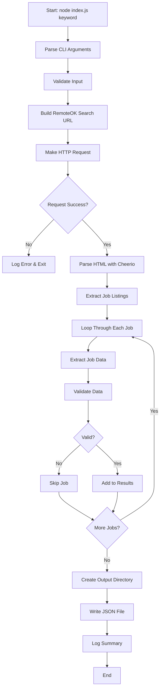

# Job Scraper Architecture Plan

## Project Overview

Production-grade Node.js web scraper for extracting REAL job listings from
RemoteOK (public job platform without CAPTCHA protection).

## Target Platform

**RemoteOK** (https://remoteok.com)

- ✅ No CAPTCHA protection
- ✅ Public job listings accessible via HTTP
- ✅ Clean HTML structure suitable for cheerio parsing
- ❌ No public recruiter contact information (limitation documented)

## Technical Stack

- **Runtime**: Node.js (v16+)
- **HTTP Client**: axios (for making HTTP requests)
- **HTML Parser**: cheerio (jQuery-like DOM manipulation)
- **No headless browsers** (as per requirements)

## Project Structure

```
hackhyre/
├── index.js              # Main scraper script
├── package.json          # Node.js dependencies
├── README.md            # Usage instructions
├── output/              # Generated JSON files (gitignored)
│   └── jobs_TIMESTAMP.json
└── plans/               # Architecture docs
    └── job-scraper-architecture.md
```

## Data Model (Output Format)

```json
{
  "job_title": "Backend Engineer",
  "company_name": "Acme Corp",
  "platform": "RemoteOK",
  "location": "Remote / USA",
  "recruiter_or_contact": null,
  "job_url": "https://remoteok.com/remote-jobs/123456",
  "company_careers_url": "https://acme.com/careers",
  "scraped_at": "2026-02-17T19:45:00.000Z"
}
```

## Core Components

### 1. Command-Line Interface

```bash
node index.js <keyword> [location]
```

- **keyword** (required): Job search term (e.g., "backend", "frontend", "product
  manager")
- **location** (optional): Location filter (e.g., "USA", "Europe")

### 2. HTTP Request Handler

**Responsibilities:**

- Make GET requests to RemoteOK search URLs
- Set realistic browser headers (User-Agent, Accept, etc.)
- Handle HTTP errors (404, 500, timeouts)
- Implement retry logic with exponential backoff

**Key Features:**

- Custom User-Agent to mimic real browser
- Accept-Language and other headers for authenticity
- Timeout configuration (30 seconds)
- Error handling with descriptive messages

### 3. HTML Parser

**Responsibilities:**

- Parse HTML response using cheerio
- Extract job listing elements from search results page
- Navigate DOM structure to find specific data points

**RemoteOK HTML Structure (to be verified):**

- Job listings typically in table rows or card elements
- Each job has: title, company, location, tags, apply link
- Company website may be in company profile link

### 4. Data Extractor

**Responsibilities:**

- Extract specific fields from each job element
- Clean and normalize data (trim whitespace, handle nulls)
- Validate required fields are present
- Build structured job objects

**Extraction Logic:**

- **job_title**: From job heading/title element
- **company_name**: From company name element
- **platform**: Hardcoded as "RemoteOK"
- **location**: From location tag/element
- **recruiter_or_contact**: Always `null` (not publicly available)
- **job_url**: Construct from job ID or extract from link
- **company_careers_url**: Extract from company profile link if available
- **scraped_at**: Current ISO timestamp

### 5. Rate Limiter

**Responsibilities:**

- Add delays between requests to avoid overwhelming server
- Configurable delay (default: 2-3 seconds)
- Respect robots.txt guidelines (documented)

**Implementation:**

```javascript
const delay = (ms) => new Promise((resolve) => setTimeout(resolve, ms));
await delay(2000); // 2 second delay
```

### 6. Data Validator

**Responsibilities:**

- Ensure required fields are present
- Validate URL formats
- Check for duplicate entries
- Filter out invalid/incomplete jobs

**Validation Rules:**

- `job_title` must be non-empty string
- `company_name` must be non-empty string
- `job_url` must be valid URL
- `scraped_at` must be valid ISO timestamp

### 7. Output Writer

**Responsibilities:**

- Write scraped data to JSON file
- Create timestamped filenames
- Ensure output directory exists
- Pretty-print JSON for readability

**Output Format:**

```json
{
  "metadata": {
    "keyword": "backend",
    "location": "USA",
    "total_jobs": 25,
    "scraped_at": "2026-02-17T19:45:00.000Z",
    "platform": "RemoteOK"
  },
  "jobs": [
    {
      /* job object */
    },
    {
      /* job object */
    }
  ]
}
```

### 8. Logger

**Responsibilities:**

- Console logging for progress tracking
- Error logging with stack traces
- Success/failure summaries

**Log Levels:**

- INFO: Starting scrape, progress updates, completion
- WARN: Missing optional fields, partial data
- ERROR: HTTP failures, parsing errors, validation failures

## Workflow Diagram



## Error Handling Strategy

### Network Errors

- **Timeout**: Retry up to 3 times with exponential backoff
- **404 Not Found**: Log error, exit gracefully
- **500 Server Error**: Retry once, then fail
- **Connection Refused**: Check URL, log error, exit

### Parsing Errors

- **Invalid HTML**: Log error, attempt partial extraction
- **Missing Elements**: Set field to null, continue
- **Malformed Data**: Skip job, log warning

### File System Errors

- **Cannot Create Directory**: Log error, exit
- **Cannot Write File**: Log error, exit
- **Permission Denied**: Log error with instructions

## Rate Limiting & Ethics

### Rate Limiting

- **Delay between requests**: 2-3 seconds
- **Max concurrent requests**: 1 (sequential only)
- **Respect server load**: Don't scrape during peak hours

### Ethical Considerations

- Check robots.txt (document findings)
- Use descriptive User-Agent identifying the scraper
- Don't overwhelm the server
- Cache results to avoid redundant requests
- Document that this is for educational/research purposes

## Known Limitations

### 1. No Recruiter Contact Information

**Why**: RemoteOK (and most job boards) don't display recruiter emails, phone
numbers, or LinkedIn profiles on public pages. This information is only shared
after applying or creating an account.

**Solution**: The `recruiter_or_contact` field will always be `null`. This is
documented in README.

### 2. Dynamic Content

**Issue**: Some job boards use JavaScript to load content dynamically.

**Mitigation**: RemoteOK serves HTML content directly, so cheerio parsing works.
If dynamic content is detected, document the limitation.

### 3. Structure Changes

**Issue**: Website HTML structure can change without notice.

**Mitigation**:

- Use flexible selectors where possible
- Add error handling for missing elements
- Document the scraper version and last verified date

### 4. IP Blocking

**Issue**: Excessive requests may lead to IP blocking.

**Mitigation**:

- Implement rate limiting
- Use reasonable delays
- Document recommended usage patterns

## Testing Strategy

### Manual Testing

1. Test with different keywords: "backend", "frontend", "product manager"
2. Test with and without location filter
3. Verify output JSON structure matches specification
4. Check error handling with invalid inputs
5. Verify rate limiting delays are working

### Validation Checks

- All required fields present in output
- URLs are valid and clickable
- Timestamps are in ISO format
- No duplicate jobs in results
- JSON is valid and pretty-printed

## Dependencies

### package.json

```json
{
  "name": "job-scraper",
  "version": "1.0.0",
  "description": "Production-grade job scraper for RemoteOK",
  "main": "index.js",
  "scripts": {
    "start": "node index.js"
  },
  "dependencies": {
    "axios": "^1.6.0",
    "cheerio": "^1.0.0-rc.12"
  },
  "engines": {
    "node": ">=16.0.0"
  }
}
```

## Usage Instructions

### Installation

```bash
cd hackhyre
npm install
```

### Running the Scraper

```bash
# Basic usage
node index.js backend

# With location filter
node index.js "product manager" USA

# View help
node index.js --help
```

### Output

- Console: Progress logs and summary
- File: `output/jobs_TIMESTAMP.json`

## Future Enhancements (Out of Scope for v0)

1. **Multiple Platforms**: Support for Indeed, LinkedIn, etc.
2. **Headless Browser**: Use Puppeteer for JavaScript-heavy sites
3. **Database Storage**: Store results in MongoDB/PostgreSQL
4. **API Endpoint**: Expose scraper as REST API
5. **Scheduling**: Cron jobs for periodic scraping
6. **Email Notifications**: Alert when new jobs match criteria
7. **Proxy Rotation**: Avoid IP blocking with proxy pools
8. **Company Data Enrichment**: Fetch additional company info from APIs

## Success Criteria

✅ Scraper runs successfully with `node index.js <keyword>` ✅ Extracts REAL job
data from RemoteOK ✅ Outputs valid JSON file with correct structure ✅ Includes
error handling for common failures ✅ Implements rate limiting (2-3 second
delays) ✅ Logs progress to console ✅ README with clear usage instructions ✅
Documents limitation: no recruiter contacts available ✅ All extracted data is
verifiable (no mock data) ✅ Job URLs are clickable and valid

## Timeline Estimate

**Note**: No time estimates provided as per instructions. Tasks are broken down
into clear, actionable steps.
